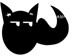

  

<h1 align="center">Foxash</h1>

  One of the easiest programming languages to learn.

---

## What is Foxash?

Foxash is a small, beginner-friendly programming language created to make programming feel approachable from the start.

It is designed for people who are new to programming and for anyone who wants a simple, readable language without unnecessary complexity. Foxash is focused on making the first steps into programming feel clear, direct, and enjoyable.

Foxash is part of the FlameDev Studios project ecosystem.

## Current status

Foxash is actively being developed and includes:

- A programming language runtime
- A command-line interface
- A standalone package
- A Windows setup wizard

## Get Foxash

Download the latest version from the repository’s **Releases** page.

For information about Foxash syntax, commands, and programming features, see the full documentation.

## Roadmap

- VS Code extension
- Additional project graphics
- Further language and tooling improvements

## Repository
This repository contains official Foxash releases, documentation, branding, and related project resources.
Foxash is closed-source software. The source code is not included in this repository.

## License

Foxash is proprietary software owned by FlameDev Studios.

Use of Foxash is governed by the terms in [`LICENSE.txt`](./LICENSE.txt). All rights are reserved unless permission is granted under that license.
